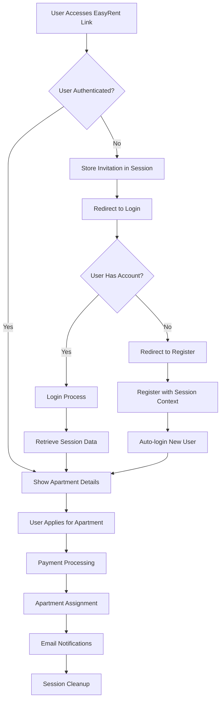

# EasyRent Link Authentication System Design

## Overview

The EasyRent Link Authentication System is a comprehensive solution that enables landlords to share apartment invitations via secure, shareable links while providing seamless authentication and registration flows for potential tenants. The system handles both authenticated and unauthenticated users, maintaining session state throughout the entire process from initial link access through payment completion and apartment assignment.

The system builds upon the existing Laravel authentication framework and apartment invitation infrastructure, extending it with sophisticated session management, email notifications, and payment integration capabilities.

## Architecture

### High-Level Architecture

The system follows a layered architecture pattern with clear separation of concerns:

```
┌─────────────────────────────────────────────────────────────┐
│                    Presentation Layer                        │
│  ┌─────────────────┐  ┌─────────────────┐  ┌──────────────┐ │
│  │   Invitation    │  │  Authentication │  │   Payment    │ │
│  │     Views       │  │      Views      │  │    Views     │ │
│  └─────────────────┘  └─────────────────┘  └──────────────┘ │
└─────────────────────────────────────────────────────────────┘
┌─────────────────────────────────────────────────────────────┐
│                    Controller Layer                          │
│  ┌─────────────────┐  ┌─────────────────┐  ┌──────────────┐ │
│  │   Invitation    │  │  Authentication │  │   Payment    │ │
│  │   Controller    │  │   Controllers   │  │  Controller  │ │
│  └─────────────────┘  └─────────────────┘  └──────────────┘ │
└─────────────────────────────────────────────────────────────┘
┌─────────────────────────────────────────────────────────────┐
│                    Service Layer                             │
│  ┌─────────────────┐  ┌─────────────────┐  ┌──────────────┐ │
│  │    Session      │  │      Email      │  │   Payment    │ │
│  │   Management    │  │  Notification   │  │ Integration  │ │
│  └─────────────────┘  └─────────────────┘  └──────────────┘ │
└─────────────────────────────────────────────────────────────┘
┌─────────────────────────────────────────────────────────────┐
│                     Data Layer                               │
│  ┌─────────────────┐  ┌─────────────────┐  ┌──────────────┐ │
│  │   Apartment     │  │      User       │  │   Payment    │ │
│  │   Invitation    │  │     Models      │  │   Models     │ │
│  └─────────────────┘  └─────────────────┘  └──────────────┘ │
└─────────────────────────────────────────────────────────────┘
```

### Authentication Flow Architecture



## Components and Interfaces

### Core Components

#### 1. Session Management Service
**Purpose**: Manages invitation context throughout the authentication flow
**Responsibilities**:
- Store invitation details for unauthenticated users
- Preserve application data during registration
- Clean up session data after completion
- Handle session expiration and timeout

#### 2. Authentication Flow Controller
**Purpose**: Orchestrates the authentication and registration process
**Responsibilities**:
- Handle invitation-based redirects
- Manage session state transfers
- Coordinate with existing auth controllers
- Process post-authentication redirects

#### 3. Apartment Invitation Controller (Enhanced)
**Purpose**: Manages the complete invitation lifecycle
**Responsibilities**:
- Generate and validate invitation links
- Handle unauthenticated access
- Process applications and payments
- Coordinate email notifications

#### 4. Email Notification Service
**Purpose**: Manages all email communications
**Responsibilities**:
- Send application notifications
- Send payment confirmations
- Send welcome emails for new users
- Handle email delivery failures

#### 5. Payment Integration Service
**Purpose**: Processes payments and apartment assignments
**Responsibilities**:
- Handle payment processing
- Update apartment assignments
- Trigger completion workflows
- Manage payment failures

### Interface Definitions

#### SessionManagerInterface
```php
interface SessionManagerInterface
{
    public function storeInvitationContext(string $token, array $data): void;
    public function retrieveInvitationContext(string $token): ?array;
    public function clearInvitationContext(string $token): void;
    public function hasInvitationContext(string $token): bool;
    public function cleanupExpiredSessions(): int;
}
```

#### EmailNotificationInterface
```php
interface EmailNotificationInterface
{
    public function sendApplicationNotification(ApartmentInvitation $invitation, Payment $payment): bool;
    public function sendPaymentConfirmation(ApartmentInvitation $invitation, Payment $payment): bool;
    public function sendWelcomeEmail(User $user, ApartmentInvitation $invitation): bool;
    public function sendAssignmentConfirmation(ApartmentInvitation $invitation, Payment $payment): bool;
}
```

## Data Models

### Enhanced ApartmentInvitation Model
```php
class ApartmentInvitation extends Model
{
    // Existing fields plus:
    protected $fillable = [
        // ... existing fields
        'session_data',           // JSON field for temporary data storage
        'authentication_required', // Boolean flag
        'registration_source',    // Track if user registered via invitation
        'session_expires_at',     // Session-specific expiration
    ];
    
    protected $casts = [
        // ... existing casts
        'session_data' => 'array',
        'session_expires_at' => 'datetime',
        'authentication_required' => 'boolean',
    ];
}
```

### Session Data Structure
```php
// Stored in session and ApartmentInvitation.session_data
[
    'invitation_token' => 'string',
    'original_url' => 'string',
    'access_timestamp' => 'datetime',
    'user_agent' => 'string',
    'ip_address' => 'string',
    'application_data' => [
        'duration' => 'integer',
        'move_in_date' => 'date',
        'additional_notes' => 'string'
    ],
    'registration_data' => [
        'first_name' => 'string',
        'last_name' => 'string',
        'email' => 'string',
        'phone' => 'string'
    ]
]
```

### Enhanced User Model
```php
class User extends Model
{
    // Add method to track EasyRent registrations
    public function isEasyRentRegistration(): bool
    {
        return $this->registration_source === 'easyrent_invitation';
    }
    
    // Check if user qualifies for marketer status
    public function qualifiesForMarketerStatus(): bool
    {
        // User must have shared referral link that resulted in landlord registration
        // AND that landlord must have at least one property with successful tenant payment
        return $this->referrals()
            ->whereHas('referred', function($query) {
                $query->whereHas('role', function($roleQuery) {
                    $roleQuery->where('name', 'landlord');
                })->whereHas('properties.apartments.payments', function($paymentQuery) {
                    $paymentQuery->where('status', 'completed');
                });
            })->exists();
    }
    
    // Automatically promote to marketer if qualified
    public function evaluateMarketerPromotion(): void
    {
        if ($this->qualifiesForMarketerStatus() && !$this->isMarketer()) {
            $this->promoteToMarketer();
        }
    }
}
```

### Marketer Qualification System

The marketer role is **earned**, not assigned. Users become marketers through the following process:

1. **Referral Link Sharing**: User shares their profile referral link
2. **Landlord Registration**: Someone registers as a landlord using that referral link
3. **Property Creation**: The referred landlord creates at least one property
4. **Tenant Payment**: A tenant makes a successful payment for that landlord's property
5. **Automatic Promotion**: The referring user is automatically promoted to marketer status

This ensures that marketers have demonstrated real value by bringing active, revenue-generating landlords to the platform.

## Correctness Properties

*A property is a characteristic or behavior that should hold true across all valid executions of a system-essentially, a formal statement about what the system should do. Properties serve as the bridge between human-readable specifications and machine-verifiable correctness guarantees.*

### Property Reflection

After analyzing all acceptance criteria, several properties can be consolidated to eliminate redundancy:

- Properties 1.1, 1.2, and 1.3 can be combined into a comprehensive invitation creation property
- Properties 2.3, 2.4, and 2.5 can be consolidated into a single authentication flow property
- Properties 3.1, 3.2, and 3.3 can be merged into a registration flow property
- Properties 4.2 and 4.3 can be combined into an apartment assignment property
- Properties 5.1, 5.2, 5.3, and 5.4 can be consolidated into a comprehensive email notification property
- Properties 7.1, 7.2, 7.3, 7.4, and 7.5 can be merged into a session lifecycle property

### Core Properties

**Property 1: Invitation Creation Integrity**
*For any* apartment invitation creation request, the system should generate a unique secure token, store all required apartment and landlord details, and create a valid shareable URL that displays comprehensive property information when accessed.
**Validates: Requirements 1.1, 1.2, 1.3**

**Property 2: Token Validation and Security**
*For any* invitation token access attempt, the system should validate token authenticity, check expiration status, record access tracking data, and use cryptographically secure tokens that cannot be guessed or tampered with.
**Validates: Requirements 1.4, 1.5, 8.1, 8.4**

**Property 3: Unauthenticated Access Flow**
*For any* unauthenticated user accessing an invitation link, the system should display apartment information without requiring immediate login, and when the user attempts to apply, redirect to login while preserving invitation context in session storage.
**Validates: Requirements 2.1, 2.2, 2.3, 2.4, 2.5**

**Property 4: Registration Flow Preservation**
*For any* new user registering via invitation link, the system should preserve invitation details throughout registration, automatically redirect to apartment application after completion, transfer session data to authenticated session, and properly attribute referral information while evaluating marketer status eligibility.
**Validates: Requirements 3.1, 3.2, 3.3, 3.4, 3.5**

**Property 5: Payment and Assignment Integration**
*For any* successful apartment payment, the system should link the user account to the specific apartment, update apartment availability status to occupied, and clear session state while maintaining application state for failed payments.
**Validates: Requirements 4.1, 4.2, 4.3, 4.4, 4.5, 4.6**

**Property 6: Email Notification Completeness**
*For any* apartment application, payment completion, or user registration via invitation, the system should send appropriate notifications to both landlord and tenant, handle delivery failures with retry logic, and include all required information in emails.
**Validates: Requirements 5.1, 5.2, 5.3, 5.4, 5.5**

**Property 7: Comprehensive System Logging**
*For any* system operation (invitation access, authentication event, payment processing, or error occurrence), the system should maintain detailed logs with timestamps, user information, transaction details, and sufficient context for debugging and performance monitoring.
**Validates: Requirements 6.1, 6.2, 6.3, 6.4, 6.5**

**Property 8: Session Lifecycle Management**
*For any* invitation session, the system should store invitation details with 24-hour expiration for unauthenticated users, persist context until payment completion for registered users, automatically cleanup data after successful payment, and handle session expiration with proper cleanup.
**Validates: Requirements 7.1, 7.2, 7.3, 7.4, 7.5**

**Property 9: Marketer Qualification Evaluation**
*For any* successful tenant payment, the system should evaluate if the landlord was referred by another user, and if so, automatically promote the referring user to marketer status when they meet qualification criteria (referred landlord with property and successful tenant payment).
**Validates: Requirements 3.4**

**Property 10: Security and Expiration Handling**
*For any* expired invitation or suspicious access pattern, the system should reject access attempts with appropriate messages, implement rate limiting and security measures, and invalidate affected invitations while notifying administrators of suspected breaches.
**Validates: Requirements 8.2, 8.3, 8.5**

## Error Handling

### Error Categories and Responses

#### 1. Authentication Errors
- **Invalid Credentials**: Maintain invitation context, redirect to registration
- **Session Timeout**: Clear expired data, require fresh invitation access
- **Registration Failures**: Preserve invitation context, allow retry

#### 2. Payment Processing Errors
- **Payment Gateway Failures**: Maintain application state, provide retry options
- **Insufficient Funds**: Clear error messaging, preserve application data
- **Network Timeouts**: Implement retry logic with exponential backoff

#### 3. System Errors
- **Database Connectivity**: Graceful degradation, error logging
- **Email Delivery Failures**: Queue for retry, log failures
- **File Upload Issues**: Clear error messages, maintain form state

#### 4. Security Errors
- **Invalid Tokens**: Reject access, log security events
- **Rate Limiting**: Temporary blocks, security notifications
- **Suspicious Activity**: Automatic invitation invalidation

### Error Recovery Strategies

#### Session Recovery
- Automatic session restoration from stored data
- Graceful handling of expired sessions
- Context preservation across authentication flows

#### Payment Recovery
- Automatic retry for transient failures
- Manual retry options for users
- State preservation during recovery attempts

#### Email Recovery
- Exponential backoff retry logic
- Alternative delivery methods
- Manual resend capabilities

## Testing Strategy

### Dual Testing Approach

The system requires both unit testing and property-based testing to ensure comprehensive coverage:

**Unit Testing Focus:**
- Specific authentication flow scenarios
- Email template rendering and delivery
- Payment gateway integration points
- Session data serialization/deserialization
- Error handling edge cases

**Property-Based Testing Focus:**
- Universal properties across all invitation flows
- Session management lifecycle validation
- Security token generation and validation
- Email notification completeness
- Payment processing integrity

### Property-Based Testing Framework

**Framework**: PHPUnit with Eris (PHP property-based testing library)
**Configuration**: Minimum 100 iterations per property test
**Test Tagging**: Each property-based test must include a comment with the format: `**Feature: easyrent-link-authentication, Property {number}: {property_text}**`

### Unit Testing Strategy

**Framework**: PHPUnit with Laravel Testing utilities
**Coverage Areas**:
- Controller method testing with mocked dependencies
- Model relationship and method testing
- Email template and content validation
- Session management service testing
- Payment integration testing

### Integration Testing

**Focus Areas**:
- End-to-end invitation flow testing
- Authentication and registration integration
- Payment processing workflow
- Email delivery and notification chains
- Session state management across requests

### Security Testing

**Areas of Focus**:
- Token generation randomness and uniqueness
- Session hijacking prevention
- Rate limiting effectiveness
- Input validation and sanitization
- SQL injection and XSS prevention

<function_calls>
<invoke name="prework">
<parameter name="featureName">easyrent-link-authentication