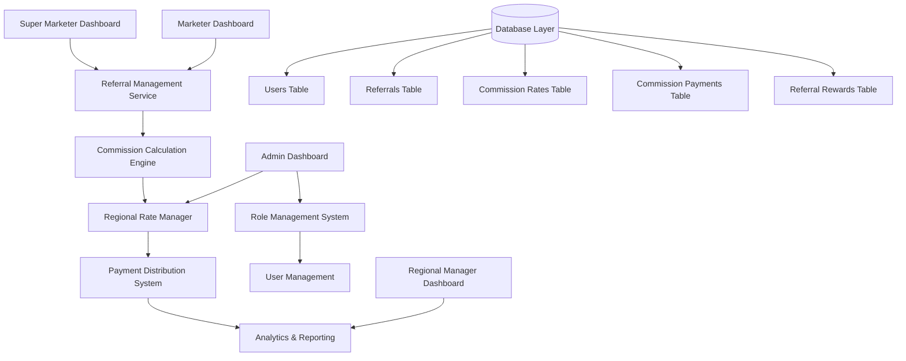
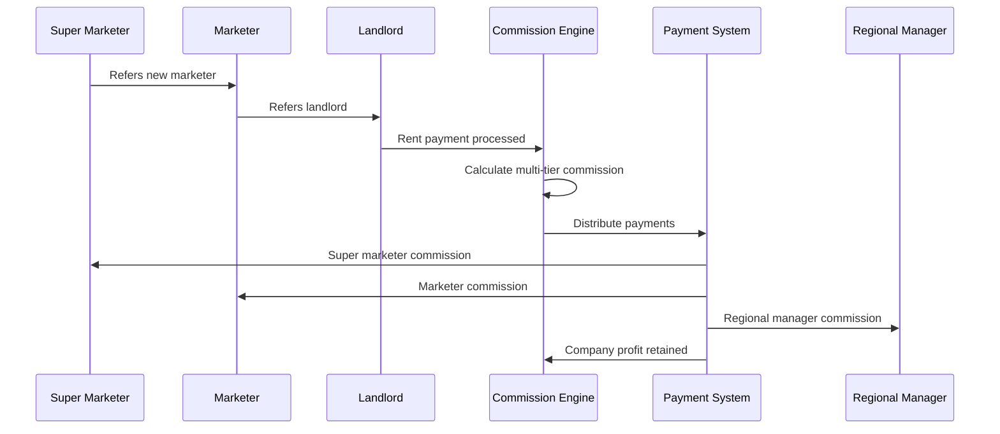

# Design Document

## Overview

The Super Marketer System extends the existing EasyRent referral and commission infrastructure to support a 3-tier hierarchical commission structure. The system introduces a new Super Marketer role (role 9) that can refer other marketers, creating a scalable network with automated multi-tier commission distribution and regional rate management capabilities.

## Architecture

### System Components



### Data Flow Architecture



## Components and Interfaces

### 1. Role Management System

#### Enhanced User Model
- **Role 7**: Super Marketer role addition
- **Referral Chain Tracking**: Support for 2-level referral hierarchy
- **Commission Rate Storage**: User-specific and regional rate overrides

```php
// Enhanced User model methods
public function isSuperMarketer(): bool
public function getReferralChain(): array
public function getCommissionRate(string $region): float
public function canReferMarketer(): bool
```

#### Role Hierarchy Interface
```php
interface RoleHierarchyInterface
{
    public function getUpstreamReferrer(int $userId): ?User;
    public function getDownstreamReferrals(int $userId): Collection;
    public function validateReferralChain(int $referrerId, int $referredId): bool;
    public function getCommissionTiers(int $userId): array;
}
```

### 2. Regional Commission Management

#### Commission Rates Table Schema
```sql
CREATE TABLE commission_rates (
    id BIGINT PRIMARY KEY AUTO_INCREMENT,
    region VARCHAR(100) NOT NULL,
    role_id INT NOT NULL,
    commission_percentage DECIMAL(5,4) NOT NULL,
    effective_from TIMESTAMP NOT NULL,
    effective_until TIMESTAMP NULL,
    created_by BIGINT NOT NULL,
    is_active BOOLEAN DEFAULT TRUE,
    created_at TIMESTAMP DEFAULT CURRENT_TIMESTAMP,
    updated_at TIMESTAMP DEFAULT CURRENT_TIMESTAMP ON UPDATE CURRENT_TIMESTAMP,
    
    INDEX idx_region_role (region, role_id),
    INDEX idx_effective_dates (effective_from, effective_until),
    FOREIGN KEY (created_by) REFERENCES users(user_id)
);
```

#### Regional Rate Manager Service
```php
class RegionalRateManager
{
    public function setRegionalRate(string $region, int $role, float $rate): bool;
    public function getActiveRate(string $region, int $role): float;
    public function validateRateConfiguration(array $rates): array;
    public function getHistoricalRates(string $region, int $role): Collection;
    public function bulkUpdateRates(array $regionRates): bool;
}
```

### 3. Multi-Tier Commission Calculation Engine

#### Commission Calculator Service
```php
class MultiTierCommissionCalculator
{
    public function calculateCommissionSplit(
        float $totalCommission,
        array $referralChain,
        string $region
    ): array;
    
    public function validateCommissionTotal(array $splits): bool;
    public function getCommissionBreakdown(int $paymentId): array;
    public function processCommissionDistribution(int $paymentId): bool;
}
```

#### Commission Distribution Logic
```php
// Commission calculation flow
1. Identify referral chain: SuperMarketer → Marketer → Landlord
2. Retrieve regional rates for property location
3. Calculate individual commission amounts
4. Validate total doesn't exceed 2.5% threshold
5. Create payment records for each participant
6. Update referral reward statuses
```

### 4. Enhanced Referral Tracking

#### Extended Referrals Table Schema
```sql
ALTER TABLE referrals ADD COLUMN (
    referral_level TINYINT DEFAULT 1,
    parent_referral_id BIGINT NULL,
    commission_tier ENUM('super_marketer', 'marketer', 'direct') DEFAULT 'direct',
    regional_rate_snapshot JSON NULL,
    
    INDEX idx_referral_level (referral_level),
    INDEX idx_parent_referral (parent_referral_id),
    FOREIGN KEY (parent_referral_id) REFERENCES referrals(id)
);
```

#### Referral Chain Service
```php
class ReferralChainService
{
    public function createReferralChain(int $superMarketerId, int $marketerId, int $landlordId): array;
    public function getReferralHierarchy(int $referralId): array;
    public function validateReferralEligibility(int $referrerId, int $referredId): bool;
    public function detectCircularReferrals(int $referrerId, int $referredId): bool;
}
```

### 5. Payment Distribution System

#### Enhanced Commission Payments
```sql
ALTER TABLE commission_payments ADD COLUMN (
    referral_chain_id BIGINT NULL,
    commission_tier ENUM('super_marketer', 'marketer', 'regional_manager') NOT NULL,
    parent_payment_id BIGINT NULL,
    regional_rate_applied DECIMAL(5,4) NOT NULL,
    
    INDEX idx_commission_tier (commission_tier),
    INDEX idx_referral_chain (referral_chain_id),
    FOREIGN KEY (parent_payment_id) REFERENCES commission_payments(id)
);
```

#### Payment Distribution Service
```php
class PaymentDistributionService
{
    public function distributeMultiTierCommission(
        float $totalAmount,
        array $referralChain,
        string $region
    ): array;
    
    public function createPaymentRecords(array $commissionSplits): bool;
    public function processPaymentBatch(array $paymentIds): bool;
    public function handleFailedPayments(array $failedPayments): void;
}
```

## Data Models

### 1. Enhanced User Model Extensions

```php
// Additional User model relationships
public function superMarketerReferrals()
{
    return $this->hasMany(Referral::class, 'referrer_id')
                ->where('commission_tier', 'super_marketer');
}

public function referredMarketers()
{
    return $this->hasManyThrough(
        User::class,
        Referral::class,
        'referrer_id',
        'user_id',
        'user_id',
        'referred_id'
    )->where('referrals.commission_tier', 'super_marketer');
}
```

### 2. Commission Rate Model

```php
class CommissionRate extends Model
{
    protected $fillable = [
        'region', 'role_id', 'commission_percentage',
        'effective_from', 'effective_until', 'created_by', 'is_active'
    ];
    
    protected $casts = [
        'commission_percentage' => 'decimal:4',
        'effective_from' => 'datetime',
        'effective_until' => 'datetime',
        'is_active' => 'boolean'
    ];
    
    public function scopeActive($query)
    {
        return $query->where('is_active', true)
                    ->where('effective_from', '<=', now())
                    ->where(function($q) {
                        $q->whereNull('effective_until')
                          ->orWhere('effective_until', '>', now());
                    });
    }
}
```

### 3. Referral Chain Model

```php
class ReferralChain extends Model
{
    protected $fillable = [
        'super_marketer_id', 'marketer_id', 'landlord_id',
        'chain_hash', 'status', 'created_at'
    ];
    
    public function superMarketer()
    {
        return $this->belongsTo(User::class, 'super_marketer_id', 'user_id');
    }
    
    public function marketer()
    {
        return $this->belongsTo(User::class, 'marketer_id', 'user_id');
    }
    
    public function landlord()
    {
        return $this->belongsTo(User::class, 'landlord_id', 'user_id');
    }
}
```

## Error Handling

### 1. Commission Calculation Errors

```php
class CommissionCalculationException extends Exception
{
    public static function invalidReferralChain(array $chain): self
    {
        return new self("Invalid referral chain: " . json_encode($chain));
    }
    
    public static function rateConfigurationError(string $region, int $role): self
    {
        return new self("No commission rate found for region: {$region}, role: {$role}");
    }
    
    public static function commissionExceedsLimit(float $total, float $limit): self
    {
        return new self("Total commission {$total}% exceeds limit {$limit}%");
    }
}
```

### 2. Payment Distribution Errors

```php
class PaymentDistributionException extends Exception
{
    public static function insufficientFunds(float $required, float $available): self
    {
        return new self("Insufficient funds: required {$required}, available {$available}");
    }
    
    public static function paymentProcessingFailed(string $reference, string $reason): self
    {
        return new self("Payment {$reference} failed: {$reason}");
    }
}
```

### 3. Fraud Prevention

```php
class FraudDetectionService
{
    public function detectSuspiciousReferrals(int $userId): array;
    public function validateReferralAuthenticity(int $referralId): bool;
    public function flagCircularReferrals(array $chain): bool;
    public function auditCommissionCalculations(int $paymentId): array;
}
```

## Testing Strategy

### 1. Unit Tests

#### Commission Calculation Tests
```php
class MultiTierCommissionCalculatorTest extends TestCase
{
    public function test_calculates_super_marketer_commission_correctly()
    public function test_handles_missing_referral_tiers()
    public function test_validates_commission_limits()
    public function test_applies_regional_rates_correctly()
}
```

#### Referral Chain Tests
```php
class ReferralChainServiceTest extends TestCase
{
    public function test_creates_valid_referral_chain()
    public function test_prevents_circular_referrals()
    public function test_validates_referral_eligibility()
    public function test_handles_broken_chains()
}
```

### 2. Integration Tests

#### Payment Flow Tests
```php
class PaymentDistributionIntegrationTest extends TestCase
{
    public function test_end_to_end_commission_distribution()
    public function test_handles_payment_failures_gracefully()
    public function test_maintains_data_consistency()
    public function test_processes_bulk_payments()
}
```

### 3. Feature Tests

#### Dashboard Tests
```php
class SuperMarketerDashboardTest extends TestCase
{
    public function test_displays_referred_marketers()
    public function test_shows_commission_breakdown()
    public function test_handles_regional_rate_changes()
    public function test_exports_performance_data()
}
```

### 4. Performance Tests

#### Load Testing
- Commission calculation performance with large referral chains
- Database query optimization for complex hierarchical queries
- Payment processing throughput testing
- Dashboard response time under load

### 5. Security Tests

#### Fraud Prevention Tests
- Circular referral detection
- Commission manipulation attempts
- Unauthorized rate modifications
- Payment tampering prevention

## Implementation Phases

### Phase 1: Database Schema Updates (Week 1)
- Create commission_rates table
- Extend referrals table with hierarchy fields
- Add Super Marketer role (9) to system
- Create referral_chains table for tracking

### Phase 2: Core Services (Week 2-3)
- Implement RegionalRateManager service
- Build MultiTierCommissionCalculator
- Create ReferralChainService
- Develop PaymentDistributionService

### Phase 3: Admin Interface (Week 4)
- Regional commission rate management UI
- Bulk rate update functionality
- Commission analytics dashboard
- Fraud detection monitoring

### Phase 4: User Dashboards (Week 5)
- Super Marketer dashboard with referral tracking
- Enhanced Marketer dashboard with hierarchy view
- Regional Manager commission breakdown
- Performance analytics and reporting

### Phase 5: Testing & Optimization (Week 6)
- Comprehensive testing suite
- Performance optimization
- Security audit
- Documentation completion

## Security Considerations

### 1. Access Control
- Role-based permissions for commission rate management
- Audit logging for all rate changes
- Secure API endpoints with proper authentication

### 2. Data Integrity
- Transaction-based commission calculations
- Referral chain validation and verification
- Payment reconciliation and audit trails

### 3. Fraud Prevention
- Automated detection of suspicious referral patterns
- Commission calculation verification
- Real-time monitoring and alerting

## Performance Optimization

### 1. Database Optimization
- Proper indexing for hierarchical queries
- Query optimization for commission calculations
- Caching strategies for regional rates

### 2. Application Performance
- Asynchronous payment processing
- Batch commission calculations
- Optimized dashboard queries

### 3. Scalability
- Horizontal scaling support
- Load balancing for payment processing
- Database sharding considerations